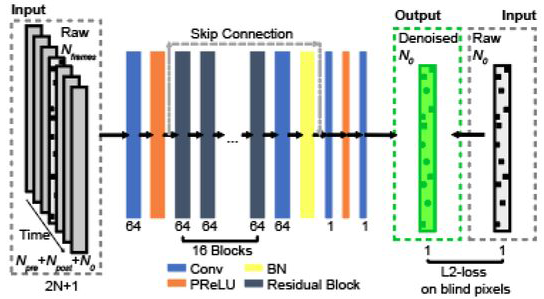
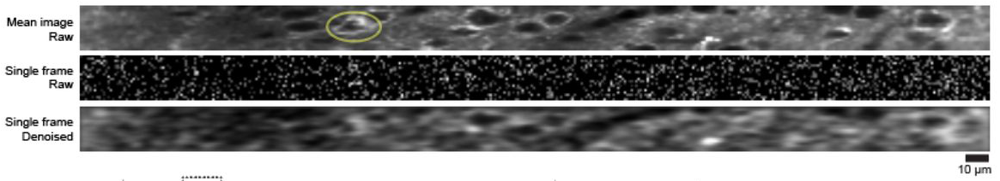

# DeepVID: A Self-supervised Deep Learning Framework for Two-photon Voltage Imaging Denoising

This repository is the implementation of the self-supervised denoising model for voltage imaging data (DeepVID), as presented in the publication: 

Platisa, J., Ye, X., Ahrens, A. M., Liu, C., Chen, I. A., Davison, I. G., ... & Chen, J. L. (2021). High-Speed Low-Light In Vivo Two-Photon Voltage Imaging of Large Neuronal Populations. bioRxiv.

https://www.biorxiv.org/content/10.1101/2021.12.07.471668v1



**Figure 1.** Training strategy and network structure of DeepVID. 



**Figure 2.** Example of single frame image denoising with DeepVID. 

## System Requirements

**requirement.txt** lists dependencies for the repository. The code should be compatible with packages in later versions. 

* Python 3.8

* Tensorflow 2.3.0

* NumPy, SciPy, Matplotlib, scikit-image, scikit-learn, h5py, tqdm

The repository was tested on CentOS 7.9.2009 with a Nvidia P100 GPU. 

## Installation Guide

This repository requires Python 3.8. If you have [Conda](https://anaconda.org/), create a virtual environment *tf2-gpu*:

```shell
$ conda create -n tf2-gpu python=3.8
```

Activate the virtual environment *tf2-gpu* and install dependencies:

```shell
$ conda activate tf2-gpu
$ pip install -r requirement.txt
```

The installation should be less than 5 mins. 

## Demo

### Training new models

* The script **./scripts/dipn2v_multi_train.py** contains the code to train the denoising model. 

* The training data should be stored in the path **./datasets/training**. 

* To begin training, run **dipn2v_multi_train.py**: 

```shell
$ python ./scripts/dipn2v_multi_train.py
```

### Denoising with a trained model

* The script **./scripts/dipn2v_inference.py** contains the code to denoise with a trained model. 

* The image to be denoised should be stored in the path **./datasets/**. 

* To begin denoising, run **dipn2v_inference.py**: 

```shell
$ python ./scripts/dipn2v_inference.py
```